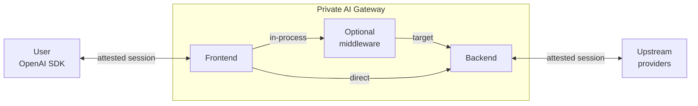

# Private AI Gateway With vLLM Router Middleware

This repository is Phala's integration of **Private AI Gateway** with an
in-process, vLLM-router-style middleware. Its purpose is to keep Private AI
Gateway as the only data-plane gateway while adding multi-upstream,
cache-aware routing inside the same attested workload.

Private AI Gateway is an OpenAI-compatible gateway for **Attested Confidential
Inference (ACI)**. It publishes dstack workload attestation for the gateway,
verifies configured private-inference upstreams before forwarding prompts, and
signs per-request receipts.

A relying party evaluates three artifacts before accepting a response: the
gateway attestation report, the provider verification event for the selected
route, and the signed receipt that binds the response to the gateway identity.

This repository is based on the Private AI Gateway implementation of the
[ACI Spec](spec/aci.md) (earlier draft discussion in
[`Dstack-TEE/dstack#694`](https://github.com/Dstack-TEE/dstack/pull/694)). It is
also a workload that
[`git-launcher`](https://github.com/Dstack-TEE/dstack-examples/tree/main/git-launcher)
can fetch, build, and run inside a dstack v2 application VM.

## Repository Purpose

This repo exists to prove and operate one specific architecture:

```text
client -> Private AI Gateway frontend -> in-process router middleware
       -> Private AI Gateway verified backend -> attested upstreams
```

The key design goals are:

- Preserve the Private AI Gateway trust chain: gateway attestation, upstream
  verification, channel binding, and signed receipts still come from the PAG
  backend.
- Move cache-aware candidate ordering into the gateway process so plaintext
  requests are not forwarded to a separate adapter or vLLM Router component.
- Keep runtime upstream add/remove on the existing authenticated
  `/v1/admin/upstreams` API. The router reads the live upstream config instead
  of requiring a static node list at startup.
- Provide an authenticated `/v1/admin/router` view for router state without
  exposing upstream secrets or prompt text.

Non-goals:

- This repo is not a standalone vLLM Router distribution.
- Middleware is not a verifier and must not mint verification facts.
- No production deployment should rely on `proxy_url` filtering as a trust
  boundary.
- Model-specific node lists, Gemma-specific tuning, or customer traffic policy
  do not belong in this codebase; they belong in deployment config.

## Audience

- Security auditors should start with the claim, limits, request flow, and
  auditor checklist.
- New users and agent developers should start with the short mental model and
  local smoke path before reading provider-specific details.

## Security Claim

When the gateway is correctly deployed in dstack with reviewed code, reviewed
runtime config, and supported provider adapters, a relying party can verify
these facts:

1. **Gateway identity**: the gateway is a specific workload running in a genuine
   TEE, with reported source provenance and a stable workload keyset.
2. **Client channel binding**: the user-facing TLS SPKI, when configured, or
   E2EE public keys are published in the attested keyset, so a client can bind
   an API session to the verified workload identity.
3. **Upstream verification**: before a prompt is forwarded, the backend verifies
   the selected upstream provider and gets an enforceable channel binding, such
   as a TLS SPKI or provider E2EE key.
4. **Fail-closed forwarding**: if verification is required and the gateway
   cannot verify the upstream or enforce the verified binding, it does not send
   the prompt.
5. **Per-request evidence**: every provider-backed inference response carries
   `x-receipt-id`. The signed receipt records the user-visible request hash, the
   selected provider route, upstream verification, provider-facing request hash,
   response hash, and any request or response modification events.

### Limits

- It does not make an arbitrary upstream provider private. A provider is only
  acceptable when its adapter can verify a provider-specific identity and
  enforce the request channel binding.
- It does not hide plaintext from gateway middleware. Middleware is optional,
  but if enabled it sees plaintext after downstream E2EE termination and must be
  part of the same attested deployment and audit boundary.
- It does not provide durable public transparency yet. Receipts are currently
  kept in memory with a configurable TTL; public transparency log integration is
  not implemented.
- It does not make a local developer run equivalent to an attested production
  deployment. The production claim depends on dstack attestation, dstack KMS,
  pinned source provenance, and reviewed runtime policy.

## How A Request Is Protected



1. The user verifies `GET /v1/attestation/report` and accepts the gateway
   workload identity and keyset.
2. The user sends an OpenAI-compatible request over ordinary TLS or ACI E2EE.
3. The frontend records the user-facing request and downstream E2EE state.
4. Optional router middleware orders the configured upstream candidates with
   cache-aware and PIG-aware load signals. It polls upstream `/v1/metrics` in
   the background, avoids PIG waiting/full routes before forwarding, preserves
   warmed-prefix affinity when pressure is acceptable, and falls back to
   gateway-local in-flight counters when metrics are missing or stale.
   Middleware does not create verification facts.
5. The backend validates the target route, verifies or refreshes the upstream
   lease, enforces the verified channel binding, and forwards the provider
   request.
6. The response returns through the same path. The frontend signs the receipt
   after it has observed the final user-visible response.

## Auditor Checklist

Use this checklist before treating a deployment as private inference.

| Check | Evidence |
| --- | --- |
| Gateway identity is real | `GET /v1/attestation/report?nonce=<fresh nonce>` proves the TEE quote, workload id, and keyset. When source provenance is present, it must match the reviewed deployment. |
| Keys are bound to the workload | The keyset in the report lists identity, receipt-signing, E2EE, and optional TLS SPKI keys endorsed by the workload identity. |
| Client session is bound | For direct TLS, verify the server certificate SPKI matches the attested keyset. For ACI E2EE, verify the E2EE public key from the keyset. |
| Upstream is verified | Receipt event `upstream.verified` must be `verified` for the provider and canonical model id. |
| Channel binding is enforceable | The upstream verification event must include a binding the backend can enforce on the actual request path. |
| Upstream session is auditable | `upstream.verified.session_id`, when present, points to `GET /v1/aci/sessions/{session_id}`. The id is derived from the target, verifier, evidence digest, provider claims, and binding material. |
| Middleware is in boundary | If middleware is enabled, audit its source/config and confirm it runs inside the same attested deployment. |
| Response is bound | Verify the receipt signature under the attested receipt key and compare the response hash in `response.returned`. |
| Provider is admissible | Review the provider's `docs/providers/<provider>/review.md` against `docs/providers/audit-criteria.md`. |

Provider verification and transport binding are backend responsibilities.
Middleware and user-controlled headers can select routes, but they do not create
verification facts.

## What New Users Should Know

You can talk to the gateway with normal OpenAI-compatible clients. The
additional ACI artifacts are:

- `GET /v1/attestation/report`: proves which gateway workload you are talking
  to.
- `x-receipt-id`: returned on provider-backed inference responses.
- `GET /v1/aci/receipts/{id}`: fetches the signed receipt by chat id or receipt id.
- `GET /v1/aci/sessions/{session_id}`: fetches an attested-session audit
  record referenced by a receipt.
- Optional ACI E2EE headers: encrypt selected request/response fields when the
  client wants application-level encryption in addition to TLS.

Useful terms:

- **TEE**: trusted execution environment. In this project, the gateway relies on
  dstack/TDX evidence to prove where the workload is running.
- **E2EE**: end-to-end field encryption between a client and the verified
  gateway workload, used when TLS alone is not enough for the client.
- **Workload identity**: the gateway identity proven by attestation and used to
  endorse receipt-signing and E2EE keys.
- **dstack KMS**: the dstack key-release service used by this implementation to
  obtain stable workload keys inside an approved TEE workload.
- **TDX quote / DCAP**: Intel TDX attestation evidence and the verification
  path used for dstack and ACI service upstream reports.
- **Receipt**: a signed per-request event log that binds the observed request,
  provider route, upstream verification result, and returned response.
- **SPKI digest**: a SHA-256 digest of a TLS public key used as channel-binding
  evidence when a verifier or attested keyset supplies it.

## Evidence Encoding

ACI evidence objects are byte-preserving:

```json
{
  "digest": "sha256:<sha256-of-decoded-data-bytes>",
  "data": "data:<content-type>;base64,<exact-bytes>"
}
```

The gateway computes `digest` over the bytes obtained by decoding the data URI,
not over a parsed JSON value. When a verifier needs to preserve multiple
upstream responses, `data` may be a `multipart/mixed` data URI whose parts carry
their original content type, source URL, and body bytes.

Do not infer provider semantics from the generic evidence wrapper. Provider
meaning belongs to the provider verifier and the provider review document. The
gateway enforces only the generic verifier result and channel binding.

## Project Status

`0.1.0` is a developer preview. The request path is implemented, but production
release still depends on provider strict-release review, durable operational
storage decisions, and production compose wiring for concrete upstream policy.

| Area | Status |
| --- | --- |
| Workload identity, keyset digest, attestation report | Implemented |
| Signed receipts and transparency event log | Implemented |
| Chat/completions, streaming, embeddings, `/v1/models` | Implemented; embeddings are buffered |
| Downstream ACI E2EE and legacy vLLM E2EE | Implemented for chat/completions/embeddings; streaming E2EE for chat/completions |
| Runtime upstream config file and admin API | Implemented |
| Gateway-owned Prometheus metrics | Implemented |
| Provider adapters | Implemented for Tinfoil, NEAR AI, Chutes, PhalaDirect, ACI service, and generic OpenAI-compatible upstreams |
| Attested-session audit records | Implemented for upstream sessions; downstream sessions pending TLS/domain work |
| Middleware framework | Implemented in-process as a single-model cache-aware router |
| Receipt store | In-memory; receipt TTL is configurable. Receipts hold hashes, not request bodies. When router middleware is enabled, the gateway keeps bounded routing-text records in a process-local radix cache index for affinity; they are not persisted or exposed by admin APIs. |
| Public transparency log | Not implemented |

The binary has no ephemeral-key or stub-quote startup mode. It loads identity,
receipt-signing, and E2EE keys from dstack KMS through the Rust `dstack-sdk`,
and it uses the same SDK for TDX quotes.

## Quick Start For New Users

This repository expects a dstack SDK endpoint. By default the gateway uses
`/var/run/dstack.sock`. For local development, set `dstack_endpoint` in the
gateway config to a forwarded dstack socket.

Prerequisites:

- Rust stable toolchain.
- A reachable dstack SDK endpoint.
- `docker compose`, `curl`, `jq`, `cargo`, `sha256sum`, and `awk` for the local
  multi-upstream smoke test.

Run checks:

```bash
cargo test
cargo fmt --all -- --check
cargo clippy --all-targets -- -D warnings
```

Start an identity-only gateway:

```bash
mkdir -p /tmp/private-ai-gateway-state
printf '[]\n' >/tmp/private-ai-gateway-upstreams.seed.json
cat >/tmp/private-ai-gateway.config.json <<EOF
{
  "state_dir": "/tmp/private-ai-gateway-state",
  "upstream_config_seed_path": "/tmp/private-ai-gateway-upstreams.seed.json",
  "dstack_endpoint": "unix:/tmp/aci-dstack-sock-dev.dstack.sock"
}
EOF

PRIVATE_AI_GATEWAY_CONFIG_PATH=/tmp/private-ai-gateway.config.json \
cargo run --release --bin private-ai-gateway
```

This starts the gateway and proves the identity surface, but it intentionally
does not configure inference routes.

In another terminal:

```bash
curl -sS http://127.0.0.1:8086/
curl -sS 'http://127.0.0.1:8086/v1/attestation/report?nonce=test'
```

To exercise actual inference behavior without provider API keys, run the local
multi-upstream smoke test:

```bash
DSTACK_SOCK=/tmp/aci-dstack-sock-dev.dstack.sock \
scripts/local_multi_upstream_smoke.sh
```

The smoke test runs two mocked upstream ACI services plus one gateway, all using
the forwarded dstack socket. It asserts model routing, receipts, upstream
verification events, and metrics.

## Verify A Response

A relying party verifies the gateway identity first, then verifies that a
receipt was signed by a key endorsed by that identity.

1. Fetch `GET /v1/attestation/report?nonce=<fresh nonce>`.
2. Send the inference request and save the response body plus the
   `x-receipt-id` response header.
3. Fetch `GET /v1/aci/receipts/{id}` with that receipt id.
4. Verify the attestation report, keyset, receipt signature, response hash, and
   `upstream.verified` event.

Use the helper script when the gateway is reachable:

```bash
uv run python scripts/live_e2e/user_verify.py \
  --base-url http://127.0.0.1:8086 \
  --chat-id "$RECEIPT_ID" \
  --nonce "$NONCE"
```

The script's `--chat-id` argument accepts either a chat id or a receipt id. To
verify already captured artifacts, run the Rust verifier directly:

```bash
cargo run --quiet --example verify_aci_artifacts -- \
  --report report.json \
  --receipt receipt.json \
  --nonce "$NONCE"
```

## Configure Upstreams

The gateway owns one mutable state directory. Set `state_dir` in the static
gateway config; if omitted, the default is `/var/lib/private-ai-gateway`.
The active upstream config is always `upstreams.json` inside that directory.

A missing, empty, or whitespace-only file is valid and means no upstreams are
configured yet. Inference routes require a JSON array with at least one
upstream:

```json
[
  {
    "name": "tinfoil-glm51",
    "provider": "tinfoil",
    "base_url": "https://inference.tinfoil.sh",
    "models": {
      "glm51-tinfoil": "glm-5-1"
    },
    "bearer_token": "<tinfoil-api-key>"
  }
]
```

`models` maps public model ids to provider-facing upstream model ids. In
no-middleware mode, the public model id is also the target route id. In
middleware mode, middleware selects a backend target route of this form:

```text
<upstream name>:<public model id in upstream config>
```

Each upstream is enabled by default. Set `"enabled": false` to keep a node in
the live config while taking it out of routing, upstream metrics polling, and
background upstream verification. The admin snapshot still shows disabled
entries so operators can re-enable them without losing the configured route.
Use `PATCH /v1/admin/upstreams/{name}` to toggle one upstream safely. `PUT
/v1/admin/upstreams` is a full replacement API and should only be used when the
caller intentionally sends the complete desired config.

Supported `provider` values:

| Provider | Use |
| --- | --- |
| `openai-compatible` | Generic OpenAI-compatible upstream with no provider-owned verifier. |
| `aci-service` | Upstream ACI service that exposes ACI attestation and dstack/DCAP evidence. |
| `tinfoil` | Tinfoil provider adapter using provider-owned verification through `private-ai-verifier`. |
| `near-ai` | NEAR AI gateway adapter with TLS binding from the provider report. |
| `chutes` | Chutes adapter with provider E2EE key verification and encrypted `/e2e/invoke` transport. |
| `phala-direct` | Direct Phala dstack-vllm-proxy endpoint (one per model) with TLS SPKI binding from the version-2 attestation report. See [docs/providers/phala-direct/verification.md](docs/providers/phala-direct/verification.md). |

ACI service verification policy is set on the upstream entry with
`accepted_workload_ids`, `accepted_image_digests`,
`accepted_dstack_kms_root_public_keys`, and `pccs_url`.

Tinfoil, NEAR AI, Chutes, and PhalaDirect use the vendored provider verifier
bridge. Set `PRIVATE_AI_VERIFIER_DIR` only when you need to override the
vendored verifier package with an external checkout.

For one-command Compose deployments, set `upstream_config_seed_path` in the
static gateway config to a read-only seed file. The gateway validates and
copies the seed to `<state_dir>/upstreams.json` only when the active config is
missing or empty. An existing admin-updated config is never overwritten.

When `admin_token` is set in the gateway config, operators can inspect and
replace the live config:

```bash
curl -H "Authorization: Bearer $PRIVATE_AI_GATEWAY_ADMIN_TOKEN" \
  http://127.0.0.1:8086/v1/admin/upstreams

curl -X PUT \
  -H "Authorization: Bearer $PRIVATE_AI_GATEWAY_ADMIN_TOKEN" \
  -H "content-type: application/json" \
  --data-binary @upstreams.json \
  http://127.0.0.1:8086/v1/admin/upstreams
```

The admin view redacts bearer tokens and returns the active `config_digest`.
If no admin token is configured, the admin endpoint returns `404`.

Set `api_token` in the static gateway config for production deployments. When
configured, `/v1/models`, `/v1/metrics`, and all OpenAI-compatible inference
POST endpoints require `Authorization: Bearer <api_token>`. `/health` and ACI
verification artifacts remain public so clients can verify the workload.

## Deploy With Git Launcher

The recommended dstack deployment path uses `git-launcher`:

1. `git-launcher` clones this repo at a pinned commit.
2. It runs this repo's `entrypoint.sh`.
3. `entrypoint.sh` builds `private-ai-gateway` with `cargo build --release
   --locked --bin private-ai-gateway`.
4. The built binary runs with runtime config from Compose environment, mounted
   files, dstack encrypted secrets, and dstack KMS.

Source provenance in attestation reports is derived from the git-launcher pin,
not from gateway JSON. If the launcher config is absent, the report omits
source provenance and the value is unknown. In production, compare the report's
source provenance with `REPO_URL` and `COMMIT_SHA` in the attested launcher
config.

The launcher stays generic. Build, install, and run logic belongs to this repo.
For production, prefer a Rust-capable gateway image so the toolchain is covered
by a gateway-owned image digest instead of installing Rust at boot.

Deployment files:

- [deploy/README.md](deploy/README.md)
- [deploy/compose.yaml](deploy/compose.yaml)
- [deploy/upstreams.example.json](deploy/upstreams.example.json)
- [entrypoint.sh](entrypoint.sh)

## Middleware

The gateway runs in direct-upstream mode unless a `middleware` section is
configured. When enabled, the middleware is the built-in single-model router: it
derives candidates from the live upstream config and orders them in-process with
cache-aware affinity from a bounded radix cache index, PIG metrics pressure
handling, and processed-count tie-breaking for idle cold traffic. Basic
requests treat both global PIG limit and basic-tier limit as capacity
constraints; premium requests use global headroom so a basic-full node can
still serve premium traffic. The inbound `x-user-tier` header is ignored and
stripped by default; enable
`middleware.trusted_user_tier_header` only behind a trusted front door that
sets or sanitizes it. This replaces the previous external adapter/vLLM Router
hop and does not use a `proxy_url`.

Streaming responses stay streaming across backend, middleware, and frontend.
Middleware-generated OpenAI-compatible responses are passed through downstream
E2EE when the original user request used E2EE.

The HTTP inference surface accepts bounded request bodies up to 32 MB. Router
middleware failures emit structured `request_outcome` logs, while streaming
body errors emit `stream_abort` and close gracefully instead of resetting the
client connection.

The middleware is configured by the `middleware` section of the static gateway
config; see the [router middleware design](docs/router-middleware.md) and the
[configuration reference](docs/configuration-reference.md#middleware).

## API Surface

| Endpoint | Purpose |
| --- | --- |
| `GET /` | Basic ACI version, workload id, and keyset digest. |
| `GET /v1/models` | OpenAI-compatible model list from backend or middleware. Requires `api_token` when configured. |
| `POST /v1/chat/completions` | OpenAI-compatible chat completions. Requires `api_token` when configured. |
| `POST /v1/completions` | OpenAI-compatible legacy completions. Requires `api_token` when configured. |
| `POST /v1/embeddings` | OpenAI-compatible buffered embeddings. Requires `api_token` when configured. |
| `GET /v1/aci/attestation?nonce=<n>` | Gateway workload identity and keyset evidence. |
| `GET /v1/aci/receipts/{id}` | Signed ACI receipt by chat id or receipt id. |
| `GET /v1/aci/sessions/{session_id}` | Attested-session record referenced by a receipt. |
| `GET /v1/aci/sessions?upstream_name=&model=` | List a provider's imported attested sessions. |
| `GET /v1/attestation/report` · `GET /v1/signature/{id}` | Legacy dstack-vllm-proxy aliases. |
| `GET /v1/metrics` | Gateway-owned Prometheus metrics. Requires `api_token` when configured. |
| `GET /v1/upstream-status` | One plain-text aggregate capacity code for downstream gateways: `0` green, `1` yellow, `2` red, `3` unknown. Requires `api_token` when configured. |
| `GET /v1/admin/upstreams` | Authenticated upstream config snapshot. |
| `PUT /v1/admin/upstreams` | Authenticated upstream config replacement. |
| `PATCH /v1/admin/upstreams/{name}` | Authenticated single-upstream enable/disable update without replacing the full config. |
| `GET /v1/admin/router` | Authenticated router middleware snapshot, including redacted PIG metrics status, when the `middleware` section is enabled. |

## Runtime Configuration

The full field and environment-variable reference is
[docs/configuration-reference.md](docs/configuration-reference.md).

The gateway consumes one read-only JSON config and one writable state directory:

| Item | Path | Mutability |
| --- | --- | --- |
| Static gateway config | `PRIVATE_AI_GATEWAY_CONFIG_PATH` | Required. Read at startup. |
| Gateway state directory | `state_dir` inside the gateway config, default `/var/lib/private-ai-gateway` | Gateway-owned writable files. |

The gateway derives its writable files from `state_dir`: `upstreams.json` for
the active upstream database and `sessions.jsonl` for the attested-session log.
Deployment-owned read-only inputs, such as an upstream seed file or TLS
certificates, stay explicit paths in the static config.

Unknown config fields are rejected at startup. See
[docs/configuration-reference.md](docs/configuration-reference.md) for the
minimal config example and the full field reference.

For client-facing TLS binding, set `tls.domain_certificates` with one mounted
leaf certificate per public hostname. The gateway reads each certificate,
computes `sha256(SPKI)`, and publishes that digest in the attested keyset. Raw
SPKI configuration is not supported; all TLS bindings are derived from mounted
certificate material.

### Multi-Domain Listening

The gateway process still has one `bind` listener. Multi-domain support means
the same gateway workload can answer attestation requests for multiple public
hostnames and select the correct downstream TLS binding from the request host.
TLS termination, certificate issuance, DNS, SNI routing, and reverse-proxy
configuration are deployment-owned and out of scope for this repo.

For each public hostname, mount the leaf certificate that the external
TLS-terminating component serves for that hostname, then list it in
`tls.domain_certificates`:

```json
{
  "tls": {
    "domain_certificates": [
      {
        "domain": "api.example.com",
        "certificate_path": "/run/certs/api.pem"
      },
      {
        "domain": "chat.example.com",
        "certificate_path": "/run/certs/chat.pem"
      }
    ]
  }
}
```

The component in front of the gateway must forward the original HTTP `Host`.
Clients should request the attestation report through the same public hostname
they will use for gateway traffic. For example, a frontend pinned to
`https://chat.example.com` should fetch
`https://chat.example.com/v1/attestation/report`; the gateway will bind
`chat.example.com` to the SPKI derived from `/run/certs/chat.pem`.

When domain bindings are configured,
`GET /v1/attestation/report` uses the request `Host` to add the matching
`attestation.evidence.downstream_tls_binding` entry while keeping all configured
TLS keys in the attested keyset. Requests whose `Host` does not match a
configured domain binding fail closed instead of returning an unbound report.

`dstack_endpoint` accepts HTTP(S) endpoints and Unix socket endpoints such as
`unix:/var/run/dstack.sock`.

## Test And Smoke Suites

Run the standard local checks:

```bash
cargo test
cargo fmt --all -- --check
cargo clippy --all-targets -- -D warnings
```

Run local multi-upstream smoke after changing routing, upstream verification,
receipt hashing, dynamic upstream config, or metrics:

```bash
scripts/local_multi_upstream_smoke.sh
```

Run live upstream smoke after changing provider adapters, attested sessions, or
receipt audit fields:

```bash
uv run python scripts/live_e2e/run.py --profile quick --port 0
```

The live smoke verifies every configured upstream in
`scripts/live_e2e/providers.json`, sends one request per supported surface, then
checks each receipt's `upstream.verified.session_id` against
`GET /v1/aci/sessions/{session_id}`.

Run the slower Phala deployment smoke when you need to validate the deployment
surface:

```bash
scripts/phala_multi_upstream_smoke.sh
```

The Phala smoke deploys two mocked upstream ACI services and one gateway CVM,
then asserts model routing, provider-facing request hashes, verified upstream
events, and metrics model ids.

## Repository Map

```text
src/main.rs                    binary entrypoint and runtime config
src/dstack.rs                  dstack SDK KMS key provider and quote provider
src/aci/                       ACI wire types, canonical JSON, keys, receipts, upstreams
src/aggregator/service.rs      report, forwarding, E2EE, receipt finalization
src/aggregator/upstream_config.rs runtime upstream config and provider adapters
src/http/app.rs                Axum HTTP routers and middleware/backend wiring
docs/                          design notes, configuration reference, provider reviews
docs/router-middleware.md      router middleware design and operating model
deploy/                        git-launcher and dstack compose examples
examples/                      cargo example binaries
scripts/                       local and Phala smoke tests
tests/                         unit and integration coverage
```

## More Docs

- [Deployment guide](deploy/README.md)
- [Router middleware](docs/router-middleware.md)
- [Configuration reference](docs/configuration-reference.md)
- [Live E2E test suite](docs/live-e2e-test-suite.md)
- [Providers (verification + audit)](docs/providers/README.md)
- [Provider audit criteria](docs/providers/audit-criteria.md)
- [Roadmap](docs/roadmap.md)
