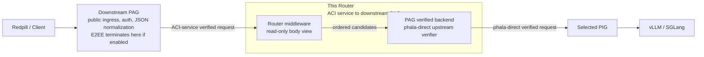

# Private AI Gateway With vLLM Router Middleware

This repository is Phala's Router-focused fork of Private AI Gateway. It keeps
the ACI proof-chain machinery from PAG and adds an in-process cache-aware,
load-aware, and tier-aware router for one public model backed by many
PIG-fronted vLLM or SGLang nodes.

The intended production chain is:

```text
Redpill / Client
  -> downstream Private AI Gateway
  -> this Router
  -> selected PIG
  -> vLLM or SGLang
```

The downstream PAG owns the public client boundary, request normalization,
billing-oriented JSON mutations, and user-facing E2EE termination if E2EE is
enabled. E2EE ends there. This Router receives the already-normalized cleartext
request bytes from downstream PAG, reads them only for routing, and forwards
those same bytes to the selected upstream.

Start here:

- [Router middleware design](docs/router-middleware.md) — the core design and
  routing algorithm.
- [PAG / Router transparent forwarding plan](docs/pag-router-transparent-forwarding-plan.md)
  — the current refactor plan and responsibility boundary.
- [Configuration reference](docs/configuration-reference.md) — static config,
  dynamic upstreams, admin APIs, metrics, and route status.
- [ACI spec](spec/aci.md) — the inherited proof-chain protocol.

## Audience

- Security reviewers should start with the claim, request flow, and auditor
  checklist below, then inspect `docs/router-middleware.md`.
- Operators should start with dynamic upstream management and the router admin
  snapshot in `docs/configuration-reference.md`.
- PAG users who need public client ingress should use upstream PAG as the
  downstream gateway and configure this Router as an `aci-service` upstream.

## Security Claim

When this Router is correctly deployed in dstack with reviewed code and runtime
config, a downstream PAG can verify these facts:

1. **Router identity**: the Router is a specific workload running in a genuine
   TEE, exposed to the downstream PAG as an ACI service.
2. **Transparent forwarding**: the request body forwarded by the middleware
   selected path is byte-for-byte equal to the body received from downstream
   PAG.
3. **Upstream verification**: before a prompt is forwarded, the selected
   PIG-fronted model node is verified through the native `phala-direct`
   provider verifier.
4. **Fail-closed forwarding**: if upstream verification is required and no
   verified channel binding can be enforced, the Router does not send the
   prompt.
5. **Per-request evidence**: every successful routed response carries
   `x-receipt-id`. The signed receipt records the received request hash,
   route selection, upstream verification, forwarded request hash, and response
   hash.

### Limits

- It is not the public client gateway in the Phala Router deployment. The
  public client boundary belongs to the downstream PAG.
- It does not terminate, implement, require, interpret, or compatibility-handle
  user-facing E2EE. If E2EE is used, it terminates at downstream PAG before this
  Router is called. Router middleware treats the downstream PAG's request body
  as already-cleartext routing input and the middleware path must never enter
  inherited E2EE handling.
- It does not normalize, rewrite, rebuild, or reserialize request bodies in the
  middleware-selected path. Any JSON mutation must happen in downstream PAG.
- It does not make an arbitrary upstream private. An upstream is acceptable only
  when its configured provider verifier can prove and enforce the requested
  channel binding.
- It does see the cleartext request bytes supplied by downstream PAG for
  routing. Therefore the Router source and runtime config remain part of the
  attested deployment and audit boundary.
- It does not provide durable public transparency yet. Receipts are currently
  kept in memory with a configurable TTL; public transparency log integration is
  not implemented.
- It does not make a local developer run equivalent to an attested production
  deployment. The production claim depends on dstack attestation, dstack KMS,
  pinned source provenance, and reviewed runtime policy.

## How A Request Is Protected


```mermaid
%%{init: {"flowchart": {"nodeSpacing": 40, "rankSpacing": 70}}}%%
flowchart LR
  client["Redpill / Client"]
  downstream["Downstream PAG<br/>public ingress, auth, JSON normalization<br/>E2EE terminates here if enabled"]

  subgraph router["This Router<br/>ACI service to downstream PAG"]
    middleware["Router middleware<br/>read-only body view"]
    backend["PAG verified backend<br/>phala-direct upstream verifier"]

    middleware -->|"ordered candidates"| backend
  end

  pig["Selected PIG"]
  engine["vLLM / SGLang"]

  client --> downstream
  downstream -->|"ACI-service verified request"| middleware
  backend -->|"phala-direct verified request"| pig
  pig --> engine
```

1. The downstream PAG verifies this Router with
   `GET /v1/aci/attestation?nonce=<fresh nonce>` and treats it as an
   `aci-service` upstream.
2. The downstream PAG sends an already-normalized OpenAI-compatible request to
   this Router.
3. Router middleware parses a read-only JSON view to extract the model, routing
   prefix, user tier, and cache/load signals.
4. Router middleware orders candidate upstreams without modifying the received
   body bytes.
5. The PAG verified backend validates the selected route, verifies or refreshes
   the upstream `phala-direct` lease, enforces the verified channel binding, and
   forwards the original request bytes.
6. The response returns through the same path. The Router signs its own receipt;
   the downstream PAG remains responsible for its outer receipt and any
   user-facing policy.

## Auditor Checklist

Use this checklist before treating a deployment as private inference.

| Check | Evidence |
| --- | --- |
| Router identity is real | Downstream PAG verifies `GET /v1/aci/attestation?nonce=<fresh nonce>` and treats this service as an `aci-service`. For dstack, verify `evidence.app_compose` against the RTMR3-bound `compose-hash`; pin the hashes you accept with `aci verify --accept-compose`. |
| User-facing E2EE is not duplicated | Downstream PAG owns client E2EE if enabled. This Router should receive cleartext request bytes from downstream PAG and must not add a second user-facing E2EE data-plane step. |
| Request body is transparent | Router receipt events for successful middleware-selected forwards should show `request.received.body_hash == middleware.forwarded.body_hash == request.forwarded.body_hash`. |
| Upstream is verified | Router receipt event `upstream.verified` must be `verified` for `provider=phala-direct` and the selected route. |
| Channel binding is enforceable | The upstream verification event must include a binding the backend can enforce on the actual request path. |
| Upstream session is auditable | `upstream.verified.session_id`, when present, points to `GET /v1/aci/sessions/{session_id}`. The id is the SHA-256 of the exact served session document bytes, so the fetched record is provably the one the receipt cited. |
| Middleware is in boundary | Audit middleware source/config and confirm it runs inside the same attested Router deployment. |
| Response is bound | Verify the receipt signature under the attested receipt key and compare the response hash in `response.returned`. |
| Provider is admissible | Phala model nodes should use `provider=phala-direct`. Other inherited PAG providers are not part of this Router deployment goal unless separately reviewed. |

Provider verification and transport binding are backend responsibilities.
Middleware and user-controlled headers can select routes, but they do not create
verification facts.

## What New Users Should Know

The downstream PAG talks to this Router with normal OpenAI-compatible requests.
Operationally useful Router artifacts are:

- `GET /v1/aci/attestation?nonce=<n>`: proves which gateway workload you are
  talking to.
- `x-receipt-id`: returned on provider-backed inference responses.
- `GET /v1/aci/receipts/{id}`: fetches the signed receipt by chat id or receipt id.
- `GET /v1/aci/sessions/{session_id}`: fetches an attested-session audit
  record referenced by a receipt.
- `GET /v1/admin/router`: authenticated router snapshot with per-route state.
- `GET /v1/admin/upstreams`: authenticated dynamic upstream config snapshot.
- `GET /v1/upstream-status`: coarse route capacity signal for downstream
  gateways.

Useful terms:

- **TEE**: trusted execution environment. In this project, the gateway relies on
  dstack/TDX evidence to prove where the workload is running.
- **Workload keyset**: the attested document listing the gateway's workload
  keys. The TEE quote binds its digest, making the keyset the unit of workload
  identity.
- **dstack KMS**: the dstack key-release service used by this implementation to
  obtain stable workload keys inside an approved TEE workload.
- **TDX quote / DCAP**: Intel TDX attestation evidence and the verification
  path used for dstack and ACI service upstream reports.
- **Receipt**: a signed per-request event log that binds the observed request,
  provider route, upstream verification result, and returned response.
- **SPKI digest**: a SHA-256 digest of a TLS public key used as channel-binding
  evidence when a verifier or attested keyset supplies it.

## Evidence Encoding

ACI evidence objects are byte-preserving:

```json
{
  "digest": "sha256:<sha256-of-decoded-data-bytes>",
  "data": "data:<content-type>;base64,<exact-bytes>"
}
```

The gateway computes `digest` over the bytes obtained by decoding the data URI,
not over a parsed JSON value. When a verifier needs to preserve multiple
upstream responses, `data` may be a `multipart/mixed` data URI whose parts carry
their original content type, source URL, and body bytes.

Do not infer provider semantics from the generic evidence wrapper. Provider
meaning belongs to the provider verifier and the provider review document. The
gateway enforces only the generic verifier result and channel binding.

## Project Status

`0.1.0` is a developer preview. The Router middleware path is implemented, but
production release still depends on source tests, image publication from pushed
source, remote proof-chain simulation, and the target deployment's reviewed
runtime config.

| Area | Status |
| --- | --- |
| Workload keyset, quote-bound keyset digest, attestation report | Implemented |
| Signed receipts | Implemented |
| Chat/completions, streaming, embeddings, `/v1/models` | Implemented; Router middleware focuses on chat/completions and completions routing. |
| User-facing E2EE | Out of scope for this Router deployment; downstream PAG owns it if enabled. |
| Runtime upstream config file and admin API | Implemented |
| Gateway-owned Prometheus metrics | Implemented |
| Provider adapters | Implemented for Tinfoil, NEAR AI, Chutes, SecretAI, PhalaDirect, ACI service, and generic OpenAI-compatible upstreams |
| Attested-session audit records | Implemented for upstream sessions; downstream sessions pending TLS/domain work |
| Middleware framework | Implemented over HTTP on Unix domain sockets |
| Receipt store | In-memory; receipt TTL is configurable. The gateway never stores request bodies (receipts hold hashes, not content). |
| Public transparency log | Not implemented |

The binary has no ephemeral-key or stub-quote startup mode. It loads workload
keys from dstack KMS through the Rust `dstack-sdk`, and it uses the same SDK for
TDX quotes. User-facing E2EE belongs to downstream PAG, outside the Router
middleware data path.

## Quick Start For New Users

This repository expects a dstack SDK endpoint. By default the gateway uses
`/var/run/dstack.sock`. For local development, set `dstack_endpoint` in the
gateway config to a forwarded dstack socket.

Prerequisites:

- Rust stable toolchain.
- A reachable dstack SDK endpoint.
- `docker compose`, `curl`, `jq`, `cargo`, `sha256sum`, and `awk` for the local
  multi-upstream smoke test.

Run checks:

```bash
cargo test
cargo fmt --all -- --check
cargo clippy --all-targets -- -D warnings
```

Start an identity-only gateway:

```bash
mkdir -p /tmp/private-ai-gateway-state
printf '[]\n' >/tmp/private-ai-gateway-upstreams.seed.json
cat >/tmp/private-ai-gateway.config.json <<EOF
{
  "state_dir": "/tmp/private-ai-gateway-state",
  "upstream_config_seed_path": "/tmp/private-ai-gateway-upstreams.seed.json",
  "dstack_endpoint": "unix:/tmp/aci-dstack-sock-dev.dstack.sock"
}
EOF

PRIVATE_AI_GATEWAY_CONFIG_PATH=/tmp/private-ai-gateway.config.json \
cargo run --release --bin private-ai-gateway
```

This starts the gateway and proves the identity surface, but it intentionally
does not configure inference routes.

In another terminal:

```bash
curl -sS http://127.0.0.1:8086/
curl -sS "http://127.0.0.1:8086/v1/aci/attestation?nonce=$(openssl rand -hex 32)"
```

To exercise actual inference behavior without provider API keys, run the local
multi-upstream smoke test:

```bash
DSTACK_SOCK=/tmp/aci-dstack-sock-dev.dstack.sock \
scripts/local_multi_upstream_smoke.sh
```

The smoke test runs two mocked upstream ACI services plus one gateway, all using
the forwarded dstack socket. It asserts model routing, receipts, upstream
verification events, and metrics.

## Verify A Response

A relying party verifies the gateway identity first, then verifies that a
receipt was signed by a key listed in the attested keyset.

1. Fetch `GET /v1/aci/attestation?nonce=<fresh nonce>`.
2. Send the inference request and save the response body plus the
   `x-receipt-id` response header.
3. Fetch `GET /v1/aci/receipts/{id}` with that receipt id.
4. Verify the attestation report, keyset, receipt signature, response hash, and
   `upstream.verified` event.

Use the helper script when the gateway is reachable:

```bash
uv run python scripts/live_e2e/user_verify.py \
  --base-url http://127.0.0.1:8086 \
  --chat-id "$RECEIPT_ID" \
  --nonce "$NONCE"
```

The script's `--chat-id` argument accepts either a chat id or a receipt id. To
verify already captured artifacts, run the `aci` CLI offline:

```bash
cargo run --bin aci -- audit \
  --report report.json \
  --receipt receipt.json \
  --nonce "$NONCE"
```

[docs/quickstart.md](docs/quickstart.md) is the full walkthrough against a
live deployment.

## Configure Upstreams

The gateway owns one mutable state directory. Set `state_dir` in the static
gateway config; if omitted, the default is `/var/lib/private-ai-gateway`.
The active upstream config is always `upstreams.json` inside that directory.

A missing, empty, or whitespace-only file is valid and means no upstreams are
configured yet. Inference routes require a JSON array with at least one
upstream:

```json
[
  {
    "name": "tinfoil-glm51",
    "provider": "tinfoil",
    "base_url": "https://inference.tinfoil.sh",
    "models": {
      "glm51-tinfoil": "glm-5-1"
    },
    "bearer_token": "<tinfoil-api-key>"
  }
]
```

`models` maps the model ids this router accepts to the model ids used for
upstream verification and provider metadata. Router middleware does not rewrite
the request body to the mapped value; the body received from downstream PAG must
already contain a model name accepted by the selected PIG/vLLM/SGLang backend.
Private Chutes deployments that use Basic authentication and the attested E2EE
transport are documented in [Private Chutes configuration](docs/providers/chutes/configuration.md).

For other scoped private OpenAI-compatible endpoints that require Basic
authentication, keep the credential in `bearer_token` and set
`"basic_auth": true`. The flag defaults to `false`, which uses Bearer
authentication.

In middleware mode, middleware selects a backend target route of this form:

```text
<upstream name>:<public model id in upstream config>
```

Supported `provider` values:

| Provider | Use |
| --- | --- |
| `openai-compatible` | Generic OpenAI-compatible upstream with no provider-owned verifier. |
| `aci-service` | Upstream ACI service that exposes ACI attestation and dstack/DCAP evidence. |
| `tinfoil` | Tinfoil provider adapter using provider-owned verification through `private-ai-verifier`. |
| `near-ai` | NEAR AI gateway adapter with TLS binding from the provider report. |
| `chutes` | Chutes adapter with provider E2EE key verification and encrypted `/e2e/invoke` transport. |
| `secret-ai` | Direct SecretAI SecretVM adapter with CPU/GPU verification, measured production workload reporting, optional workload pinning, and enforced inference TLS SPKI. See [docs/providers/secret-ai/verification.md](docs/providers/secret-ai/verification.md). |
| `phala-direct` | Direct Phala dstack-vllm-proxy endpoint (one per model) with TLS SPKI binding from the version-2 attestation report. See [docs/providers/phala-direct/verification.md](docs/providers/phala-direct/verification.md). |

ACI service verification policy is set on the upstream entry with
`accepted_subjects`, `accepted_image_digests`,
`accepted_dstack_kms_root_public_keys`, and `pccs_url`.

Tinfoil, NEAR AI, Chutes, SecretAI, and PhalaDirect use the Python provider
verifier bridge. Set `PRIVATE_AI_VERIFIER_DIR` only when you need to override
the bridge's vendored `confidential_verifier` package with an external checkout.

For one-command Compose deployments, set `upstream_config_seed_path` in the
static gateway config to a read-only seed file. The gateway validates and
copies the seed to `<state_dir>/upstreams.json` only when the active config is
missing or empty. An existing admin-updated config is never overwritten.

When `admin_token` is set in the gateway config, operators can inspect and
replace the live config:

```bash
curl -H "Authorization: Bearer $PRIVATE_AI_GATEWAY_ADMIN_TOKEN" \
  http://127.0.0.1:8086/v1/admin/upstreams

curl -X PUT \
  -H "Authorization: Bearer $PRIVATE_AI_GATEWAY_ADMIN_TOKEN" \
  -H "content-type: application/json" \
  --data-binary @upstreams.json \
  http://127.0.0.1:8086/v1/admin/upstreams
```

The admin view redacts bearer tokens and returns the active `config_digest`.
If no admin token is configured, the admin endpoint returns `404`.

## Deploy With Git Launcher

The recommended dstack deployment path uses `git-launcher`:

1. `git-launcher` clones this repo at a pinned commit.
2. It runs this repo's `entrypoint.sh`.
3. `entrypoint.sh` builds `private-ai-gateway` with `cargo build --release
   --locked --bin private-ai-gateway`.
4. The built binary runs with runtime config from Compose environment, mounted
   files, dstack encrypted secrets, and dstack KMS.

Source provenance in attestation reports is derived from the git-launcher pin,
not from gateway JSON. If the launcher config is absent, the report omits
source provenance and the value is unknown. The current native verifier does not
yet bind the reported commit or image digest to reviewed source; that policy is
an explicit TODO.

The canonical report publishes the exact measured `app_compose` preimage so an
independent verifier can check it against the RTMR3-bound `compose-hash`. Keep
plaintext secrets out of the Compose file. Supply values through Phala encrypted
environment variables; the measured Compose contains the variable references,
not their values.

The launcher stays generic. Build, install, and run logic belongs to this repo.
For production, prefer a Rust-capable gateway image so the toolchain is covered
by a gateway-owned image digest instead of installing Rust at boot.

Deployment files:

- [deploy/README.md](deploy/README.md)
- [deploy/compose.yaml](deploy/compose.yaml)
- [deploy/upstreams.example.json](deploy/upstreams.example.json)
- [entrypoint.sh](entrypoint.sh)

## Middleware

The gateway runs in no-middleware mode unless middleware is configured. In
middleware mode the middleware runs in-process, between the frontend and
backend:

- Public `/v1/models` is served from the configured single router model.
- Public inference requests are validated by the Router frontend, then handed
  to the middleware, which reads the parsed JSON only to order configured
  upstream candidates with cache affinity plus PIG load/pressure signals.
  Client-facing decryption and request-body normalization belong in downstream
  PAG before it calls this Router.
- The middleware forwards the exact cleartext request bytes it received through
  the backend. It can transform cross-format responses, inject usage cost, and
  send a best-effort post-request usage report when `middleware.control_url` is
  configured. Verification facts still come from the backend.
- Streaming responses stay streaming across backend, middleware, and frontend.
- In the Phala router deployment, user-facing E2EE terminates at the downstream
  PAG before this router is called. The router middleware does not participate
  in that data-plane step.

The middleware is configured by the `middleware` section of the static gateway
config; see the [configuration reference](docs/configuration-reference.md#middleware)
and [router middleware design](docs/router-middleware.md).

## API Surface

| Endpoint | Purpose |
| --- | --- |
| `GET /` | Basic ACI version and keyset digest. |
| `GET /v1/models` | OpenAI-compatible model list from backend or middleware. |
| `POST /v1/chat/completions` | OpenAI-compatible chat completions. |
| `POST /v1/completions` | OpenAI-compatible legacy completions. |
| `POST /v1/embeddings` | OpenAI-compatible buffered embeddings. |
| `GET /v1/aci/attestation?nonce=<n>` | Gateway attestation report: quote, keyset, provenance. |
| `GET /v1/aci/receipts/{id}` | Signed ACI receipt by chat id or receipt id. |
| `GET /v1/aci/sessions/{session_id}` | Attested-session record referenced by a receipt. |
| `GET /v1/aci/sessions?upstream_name=&model=` | List a provider's imported attested sessions. |
| `GET /v1/attestation/report` · `GET /v1/signature/{id}` | Legacy dstack-vllm-proxy aliases. |
| `GET /v1/metrics` | Gateway-owned Prometheus metrics plus Router cache-affinity outcome and token-efficiency metrics when middleware is enabled. |
| `GET /v1/admin/upstreams` | Authenticated upstream config snapshot. |
| `PUT /v1/admin/upstreams` | Authenticated upstream config replacement. |

## Runtime Configuration

The full field and environment-variable reference is
[docs/configuration-reference.md](docs/configuration-reference.md).

The gateway consumes one read-only JSON config and one writable state directory:

| Item | Path | Mutability |
| --- | --- | --- |
| Static gateway config | `PRIVATE_AI_GATEWAY_CONFIG_PATH` | Required. Read at startup. |
| Gateway state directory | `state_dir` inside the gateway config, default `/var/lib/private-ai-gateway` | Gateway-owned writable files. |

The gateway derives its writable files from `state_dir`: `upstreams.json` for
the active upstream database and `sessions.jsonl` for the attested-session log.
Deployment-owned read-only inputs, such as an upstream seed file or TLS
certificates, stay explicit paths in the static config.

Unknown config fields are rejected at startup. See
[docs/configuration-reference.md](docs/configuration-reference.md) for the
minimal config example and the full field reference.

For client-facing TLS binding, set `tls.domain_certificates` with one mounted
leaf certificate per public hostname. The gateway reads each certificate,
computes `sha256(SPKI)`, and publishes that digest in the attested keyset. Raw
SPKI configuration is not supported; all TLS bindings are derived from mounted
certificate material.

### Multi-Domain Listening

The gateway process still has one `bind` listener. Multi-domain support means
the same gateway workload can answer attestation requests for multiple public
hostnames and select the correct downstream TLS binding from the request host.
TLS termination, certificate issuance, DNS, SNI routing, and reverse-proxy
configuration are deployment-owned and out of scope for this repo.

For each public hostname, mount the leaf certificate that the external
TLS-terminating component serves for that hostname, then list it in
`tls.domain_certificates`:

```json
{
  "tls": {
    "domain_certificates": [
      {
        "domain": "api.example.com",
        "certificate_path": "/run/certs/api.pem"
      },
      {
        "domain": "chat.example.com",
        "certificate_path": "/run/certs/chat.pem"
      }
    ]
  }
}
```

The component in front of the gateway must forward the original HTTP `Host`.
Clients should request the attestation report through the same public hostname
they will use for gateway traffic. For example, a frontend pinned to
`https://chat.example.com` should fetch
`https://chat.example.com/v1/aci/attestation`; the gateway will bind
`chat.example.com` to the SPKI derived from `/run/certs/chat.pem`.

When domain bindings are configured,
`GET /v1/aci/attestation` uses the request `Host` to add the matching
`attestation.evidence.downstream_tls_binding` entry while keeping all configured
TLS keys in the attested keyset. Requests whose `Host` does not match a
configured domain binding fail closed instead of returning an unbound report.

`dstack_endpoint` accepts HTTP(S) endpoints and Unix socket endpoints such as
`unix:/var/run/dstack.sock`.

## Test And Smoke Suites

Run the standard local checks:

```bash
cargo test
cargo fmt --all -- --check
cargo clippy --all-targets -- -D warnings
```

Run local multi-upstream smoke after changing routing, upstream verification,
receipt hashing, dynamic upstream config, or metrics:

```bash
scripts/local_multi_upstream_smoke.sh
```

Run live upstream smoke after changing provider adapters, attested sessions, or
receipt audit fields:

```bash
uv run python scripts/live_e2e/run.py --profile quick --port 0
```

The live smoke verifies every configured upstream in
`scripts/live_e2e/providers.json`, sends one request per supported surface, then
checks each receipt's `upstream.verified.session_id` against
`GET /v1/aci/sessions/{session_id}`.

Run the slower Phala deployment smoke when you need to validate the deployment
surface:

```bash
scripts/phala_multi_upstream_smoke.sh
```

The Phala smoke deploys two mocked upstream ACI services and one gateway CVM,
then asserts model routing, forwarded request hashes, verified upstream
events, and metrics model ids.

## Repository Map

```text
src/main.rs                    binary entrypoint and runtime config
src/dstack.rs                  dstack SDK KMS key provider and quote provider
src/aci/                       ACI wire types, keys, receipts, upstreams
src/aggregator/service.rs      inherited PAG service: report, forwarding, receipt finalization
src/aggregator/upstream_config.rs runtime upstream config and provider adapters
src/http/app.rs                Axum HTTP routers and middleware/backend wiring
src/bin/aci/                   `aci` verifier CLI: verify, audit, sessions, send, serve
clients/                       verifier-ts verifier library (browser + node)
docs/                          design notes, configuration reference, provider reviews
deploy/                        git-launcher and dstack compose examples
examples/                      cargo example binaries + a reference control plane (control-plane/)
scripts/                       local and Phala smoke tests
tests/                         unit and integration coverage
```

## More Docs

- [ACI spec, quickstart, and test vectors](spec/README.md)
- [Client verifiers](clients/README.md)
- [Deployment guide](deploy/README.md)
- [Configuration reference](docs/configuration-reference.md)
- [Live E2E test suite](docs/live-e2e-test-suite.md)
- [Providers (verification + audit)](docs/providers/README.md)
- [Provider audit criteria](docs/providers/audit-criteria.md)
- [Roadmap](docs/roadmap.md)
