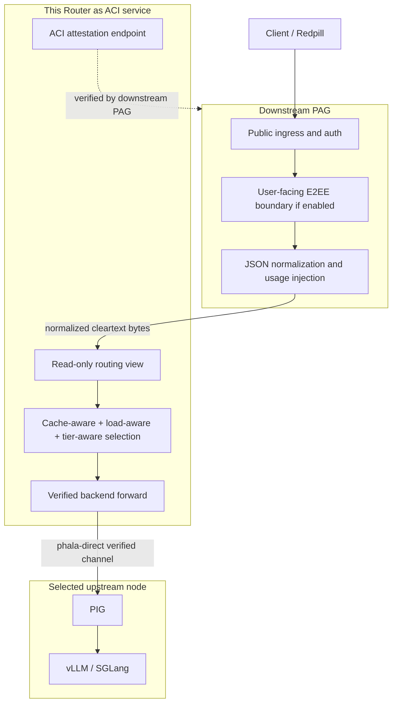

# PAG / Router Transparent Forwarding Plan

## Goal

Refactor the Phala router deployment so the responsibilities are split cleanly:

- Downstream PAG owns the public client boundary.
- Downstream PAG owns authentication, user-facing E2EE, request normalization,
  JSON compatibility mutations, and usage-related request injection.
- This Router presents itself to downstream PAG as an `aci-service`.
- This Router verifies selected upstream model nodes through `phala-direct`.
- This Router reads request bytes only to build a routing view for
  cache-aware, load-aware, and tier-aware selection.
- This Router forwards the exact received body bytes to the selected upstream.

The key invariant is:

```text
request.received.body_hash
  == middleware.forwarded.body_hash
  == request.forwarded.body_hash
```

for successful middleware-selected forwards.

## Boundary Correction

User-facing E2EE is not a Router middleware feature in this deployment.

```text
Client / Redpill
  -> downstream PAG
     - terminates user-facing E2EE if enabled
     - authenticates the public request
     - applies request JSON compatibility mutations
     - injects streaming usage options when needed
  -> this Router
     - receives already-normalized cleartext bytes
     - reads a routing-only JSON view
     - selects and orders verified upstream candidates
     - forwards the same bytes without rewriting
  -> selected PIG
  -> vLLM or SGLang
```

Router middleware must not decrypt, encrypt, interpret, or compatibility-handle
user-facing E2EE. Inherited PAG E2EE code may remain for non-middleware PAG
paths, but the middleware-selected path must not enter it.

## Architecture



## Implementation Rules

1. Middleware mode must bypass inherited PAG user-facing E2EE request handling.
2. Middleware may parse the body only into a temporary routing view.
3. Middleware must not rewrite, rebuild, or reserialize the forwarded request
   body.
4. Router-side model mapping must not trigger a body rewrite on
   middleware-selected forwards.
5. Client-facing headers, user-facing E2EE headers, and untrusted tier headers
   must not leak upstream.
6. Upstream authorization must come from upstream configuration, not from the
   downstream request.
7. The selected upstream must pass required `phala-direct` verification before
   prompt bytes are sent.
8. If verification is required and cannot be established or enforced, the
   Router must fail closed before forwarding prompt bytes.
9. Request JSON compatibility changes belong in downstream PAG, not in this
   Router.
10. Cache affinity is only a routing optimization; it is not a proof claim and
    must remain behind the load and pressure guard.

## PAG PR Scope

The downstream PAG change should contain the JSON mutations that this Router
must no longer perform, including streaming usage option injection for routed
requests. That keeps body mutation at the public gateway layer where request
normalization already belongs.

Router source must stay transparent after that change: it can read the request
for route selection, but the bytes passed to the verified backend must be the
original bytes received from downstream PAG.

## Router Scope

Router keeps only these deployment-specific behaviors:

- `aci-service` identity and attestation surface for downstream PAG.
- Dynamic upstream management and route status APIs.
- Cache-aware route preference using process-local prefix history.
- Load-aware and tier-aware guards from local counters and PIG metrics.
- `phala-direct` upstream verification through the inherited PAG backend path.
- Receipt events that expose route selection and body-hash equality.

Router does not own:

- public client authentication policy;
- user-facing E2EE;
- OpenAI request compatibility rewrites;
- billing usage injection;
- provider-specific model JSON cleanup;
- response pricing policy for the outer user-facing gateway.

## Source Review Checklist

- `src/http/app/handlers.rs` keeps middleware mode out of inherited E2EE
  request handling.
- `src/middleware/completion.rs` forwards candidates with the received body
  bytes.
- `src/aci/upstream/router.rs` skips model body rewrite for
  middleware-selected routes.
- Header construction for middleware forwards starts from a clean upstream
  header map.
- Tests assert body-byte equality and absence of leaked user-facing E2EE
  headers.
- Tests assert upstream auth uses configured upstream credentials.
- Tests assert trusted and untrusted `x-user-tier` handling.

## Test Plan

Source tests:

```text
cargo fmt --check
cargo check --lib
cargo test --lib
cargo test --test http
cargo test --test middleware_completion
cargo test --tests
```

Builder tests must run from the exact pushed commit before image publication.
Windows-local results are not release evidence for this repository.

Runtime simulation must prove:

- downstream PAG can verify this Router as `aci-service`;
- this Router verifies selected PIG upstreams as `phala-direct`;
- request hashes remain equal across received, middleware-forwarded, and
  backend-forwarded receipt events;
- cache-aware and load-aware route ordering works under multiple upstreams;
- verification failure fails closed before prompt forwarding;
- no user-facing E2EE compatibility path is entered by middleware mode.

## Release Gates

1. Push Router source first.
2. Re-clone or reset the remote builder checkout to the pushed commit.
3. Run builder source tests from that pushed commit.
4. Build the image from that pushed commit.
5. Push the image and record the registry digest.
6. Run proof-chain and routing simulation with the image.
7. Only after explicit deployment authorization, update Router CVMs with the
   established drain-safe procedure.
